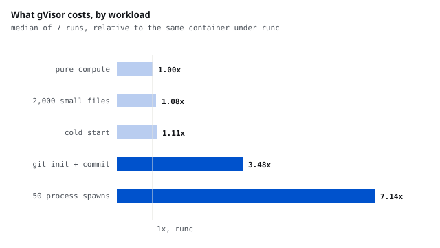

# What gVisor stops, and what it costs, for agent-generated code

<b>Stack</b> gVisor, Docker, seccomp, Linux namespaces, C, Python<b>Role</b> Solo<b>Method</b> 7 isolation configurations, direct syscall probes

<a class="btn btn--solid" href="https://github.com/AshrithaG/agent-sandbox-bench" target="_blank" rel="noopener">Code on GitHub</a>

<figure><figcaption>The cost is concentrated in process creation. Compute and file work are nearly free.</figcaption></figure>

## The decision this is for

Agents write code and something has to run it. The usual answer is a container,
and the usual upgrade is gVisor, which puts a user-space kernel between the code
and the host. Both choices are made on reputation far more often than on
measurement. I wanted numbers for the two questions that actually decide it:
what does each option stop, and what does it cost on the kind of work an agent
does.

Same image, same code, seven configurations: Docker's default runtime, the same
with every cheap hardening flag, gVisor, gVisor hardened, and three ablations
that separate the flags from the runtime.

<b>1.00x</b>gVisor's cost on pure compute

<b>7.14x</b>its cost on spawning processes

<b>10 forks</b>before a process limit killed the whole sandbox

<b>ENOSYS</b>what io_uring becomes under gVisor, instead of a filtered syscall

## What each one stopped

The probes are direct system calls with deliberately invalid arguments, so the
answer comes from the kernel rather than from a missing binary. `EINVAL` means
the call reached a kernel, `EPERM` means a filter stopped it first, and `ENOSYS`
means the kernel it reached does not implement it at all.

| probe | Docker default | gVisor |
|---|---|---|
| the kernel the code sees | the host's 6.8.0 | 4.19.0-gvisor |
| io_uring, userfaultfd, keyctl | EPERM, filtered | ENOSYS, absent |
| mount, bpf | EPERM | EPERM |
| create a user namespace | EPERM | allowed, inside gVisor |
| network egress, fork storm, 1.5 GB allocation | allowed | allowed |

The difference worth paying for is `EPERM` against `ENOSYS`. Under a normal
container, io_uring and userfaultfd are filtered but still present in the host
kernel the code is talking to, one seccomp mistake away. Under gVisor they do
not exist in the kernel the code can reach. Note also that "allowed" under
gVisor is a weaker statement: creating a user namespace succeeds, but gVisor's
own kernel handles it and the host never sees it.

Neither runtime stops network egress, fork storms or memory exhaustion on its
own. Those need flags whatever the runtime.

## A limit that behaves differently than you would expect

With a process limit of 50 in place, Docker's default runtime returned `EAGAIN`
on the fiftieth fork and the program carried on. Under gVisor, the entire
sandbox died after ten forks, exit code 2, no error printed, not an out-of-memory
kill. The limit counts host processes, and gVisor's own machinery lives in that
budget, so the guest gets a fraction of it, and crossing it takes down
everything in the sandbox rather than failing the one call that crossed it.

For an agent runtime that matters twice: a limit sized for one runtime is the
wrong size for the other, and a runaway build inside gVisor looks like a crash
with no diagnostic.

## What it costs

| workload | gVisor, relative to a normal container |
|---|---|
| pure Python compute | 1.00x |
| 2,000 small files: create, stat, delete | 1.08x |
| container cold start | 1.11x |
| git init, 200 files, commit | 3.48x |
| 50 process spawns | 7.14x |

The cost is process creation, not compute and not file I/O, which is the useful
shape: an agent that runs a long computation pays nothing, and one that shells
out constantly pays a lot.

The ablations settled two things I would otherwise have got wrong. A one-CPU
quota, not gVisor, is what doubles the hardened overhead, because gVisor's
user-space kernel needs CPU of its own to handle system calls. And "hardened is
faster" is an artifact of mounting a memory-backed scratch directory, which
helps a normal container and does nothing under gVisor, since gVisor already
keeps the container's writes in its own memory.

## The first version of this got it wrong

My harness scored empty output as "allowed", which turned gVisor killing the
sandbox into a striking and false claim that it ignores process limits. It now
distinguishes a clean refusal, no limit at all, and a killed sandbox. The
ablations were added for the same reason: the hardened bundle changes several
things at once, and without separating them the cost numbers say nothing about
which change caused what.

## Limits

One VM, arm64, gVisor's systrap platform, no KVM. Seven repetitions per cell,
with the ranges published alongside the medians. The probes test whether a call
is reachable, not whether an exploit works: nothing here attempts an escape.
Firecracker and Kata need hardware virtualization the VM does not have, so the
comparison stops at gVisor.
