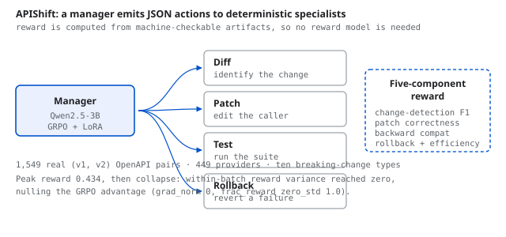

# APIShift: verifiable agent learning for API contract migration

<b>Venue</b> EMNLP 2026, under review<b>Stack</b> GRPO, LoRA, Qwen2.5-3B, single RTX 3090<b>Role</b> Solo

<figure><figcaption>The training scaffold: a manager emits JSON actions to four deterministic specialists, scored by a five-component reward computed from machine-checkable artifacts.</figcaption></figure>

## The problem

APIs break their contracts. A field is renamed, a type changes, an endpoint is versioned away, and every
downstream caller has to be migrated. It is exactly the kind of task an agent should be good at, and
exactly the kind of task that is hard to train because "did it work" is usually a human judgement.

Except here it is not. A migration either passes the tests or it does not. That makes the reward
**verifiable**, which makes reinforcement learning viable without a learned reward model.

<b>1,549</b>real API version pairs

<b>449</b>providers covered

<b>10</b>breaking-change types

<b>0.434</b>peak reward before collapse

## The environment

I built a training environment over **1,549 real API version pairs from 449 providers**, spanning ten
categories of breaking change rather than synthetic mutations.

The agent is structured as a manager that emits JSON actions to four specialists:

- **Diff**, which identifies what changed between contract versions.
- **Patch**, which edits the calling code.
- **Test**, which runs the suite and reports.
- **Rollback**, which reverts a failed patch so the episode can continue.

Reward has five components, combining test outcomes with structural checks on the patch, so a model
cannot score by deleting the failing test.

## Training, and the collapse

I trained Qwen2.5-3B with **GRPO and LoRA on a single RTX 3090**. Reward climbed to a peak of **0.434**,
then flattened, then stopped learning entirely.

The diagnosis is specific. GRPO computes its advantage from the **variance of rewards within a batch of
sampled rollouts**. As the policy converged, every rollout in a batch started earning the same reward.
Variance went to zero. Advantage went to zero. Gradient went to zero.

Two logged signals confirm it rather than merely suggesting it:

| Signal | Value |
|---|---|
| `grad_norm` | 0 |
| `frac_reward_zero_std` | 1.0 |

`frac_reward_zero_std` at 1.0 means **every single batch** had zero reward standard deviation. The
optimiser was still running. There was nothing left for it to push against.

## Why the negative result is the contribution

This is a known failure mode of group-relative methods, but it is usually described abstractly. Here it
is instrumented on a real task with the exact signals that identify it, which is what makes the repair
directions concrete:

- **Reward shaping with denser intermediate credit**, so partial progress separates rollouts that
  currently tie.
- **Harder curriculum sampling**, keeping batches populated with instances the policy has not solved.
- **Larger group sizes**, which raises the chance any batch contains a spread.

## Status

Under review at EMNLP 2026. The environment and the reward specification are the reusable parts.
