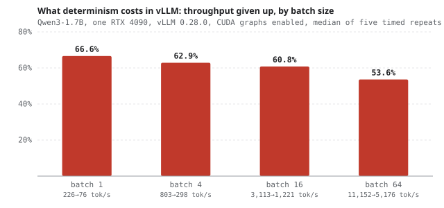

# What determinism actually costs in vLLM

<b>Stack</b> vLLM 0.28, Qwen3-1.7B, RTX 4090, CUDA graphs<b>Role</b> Solo

<a class="btn btn--solid" href="https://github.com/AshrithaG/batch-invariance" target="_blank" rel="noopener">Code on GitHub</a>

<figure><figcaption>Throughput given up to make results reproducible, by batch size. Qwen3-1.7B on one RTX 4090, vLLM 0.28.0 with CUDA graphs enabled, median of five timed repeats.</figcaption></figure>

## The problem

Temperature zero is supposed to be deterministic. Ask the same question twice, get the same answer.

It is not, and the reason is batching. Requests are batched together for throughput, batching changes
the reduction order inside the kernels, floating-point addition is not associative, and the logits move
by a hair. Usually that hair does not change the argmax. Sometimes it does.

vLLM ships `VLLM_BATCH_INVARIANT=1` to fix this. The documentation says it costs throughput. It does not
say how much. So I measured it.

<b>15 of 30</b>prompts changed their answer under batch composition alone

<b>54 to 67%</b>of throughput given up with the fix on

<b>2x</b>the cost eager-mode measurement suggests

## The harness

I built a probe that isolates four variables independently, because they are usually confounded:

- **Batch size**, holding composition fixed.
- **Batch composition**, holding size fixed. This is the one that matters and the one most tests miss.
- **Repeat rate**, to separate genuine nondeterminism from sampling.
- **Throughput**, measured on the same runs so the tradeoff is a single curve rather than two studies.

## What came out

**The effect is large.** 15 of 30 prompts changed their temperature-zero answer purely as a function of
which other prompts were in the batch. Same weights, same prompt, same temperature, different neighbours.
With CUDA graphs on, vLLM's default, it was 13 of 30.

**The fix works completely.** With `VLLM_BATCH_INVARIANT=1`, all 30 prompts became stable across every
batch composition tested, with CUDA graphs on and off. No partial mitigation. I first checked this only in
eager mode and have since verified it in the same configuration as the cost.

**The price is 54 to 67% of throughput.** The invariant path runs at 33 to 46% of baseline with CUDA
graphs enabled. For anyone doing evaluation, A/B testing, or regression gating on LLM outputs, that is
the actual exchange rate between reproducibility and serving cost, and the documentation does not state it.
vLLM 0.29.0 has since shipped kernels tuned for this GPU, so newer versions should cost less; I have not
re-measured them.

## The measurement trap

My first numbers were much friendlier, around half the cost. They were taken in **eager mode**.

With CUDA graphs disabled, per-kernel launch overhead dominates and swamps the difference between the
two reduction strategies, which makes the invariant path look cheap. Turn CUDA graphs on, which is what
anyone serving in production does, and the real gap appears: the invariant kernels are 2.2 to 3.0x
slower, where eager mode showed 1.4x.

So the honest headline is that **eager-mode measurement understates the cost of determinism by about
half**. If you benchmarked this the obvious way, you would ship the wrong number.

## Why I care about this

It feeds directly into [The Replay Gap](projects.html?p=replay-gap). If you cannot reproduce a single
generation, you cannot cleanly attribute a difference between two agent policies to the policies. This
work sets the floor on how finely any such comparison can resolve.
