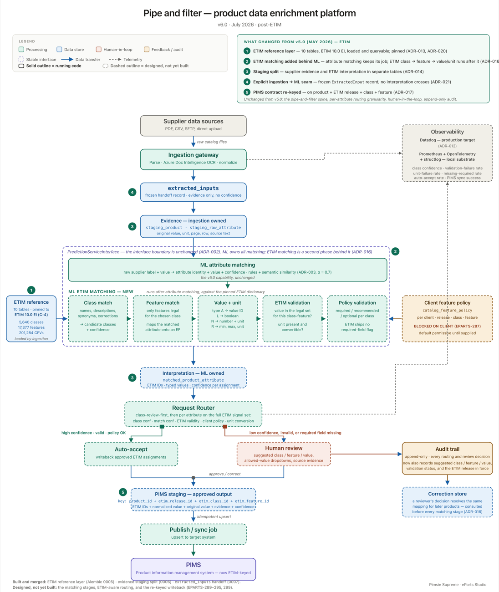

# Confidence-routed attribute prediction at 4.08M rows

<b>Context</b> CMU MSE Studio, industry client<b>Role</b> Technical Lead, ML and Architecture, leading 5 engineers<b>Stack</b> BGE, FAISS, FastAPI, Prometheus, Python 3.12

An architecture diagram is the right hero for this one. Drop it at <code>images/hero.png</code> and replace this block with <code></code>

## What it is

A production attribute-prediction service for an industry client, shipping under a real deadline with a
real acceptance bar. Given a product, predict its attributes accurately enough that most predictions can
be accepted automatically and only the uncertain ones reach a human.

This is the project on this page with users, a client, and a team. I lead five engineers on it.

<b>95.74%</b>accuracy on 143K held-out predictions

<b>4.08M</b>attribute rows

<b>289</b>tests behind an 85% branch-coverage gate

<b>50 req/s</b>at a 200ms p95 SLO

## Architecture

Three paths, combined by a router that knows when to abstain:

- **Retrieval.** BGE embeddings over a FAISS index, for products where a semantic neighbour carries the
  answer.
- **Rules.** A 198,000-pattern rule engine, for the large fraction of attributes that are genuinely
  deterministic given the product text.
- **Confidence routing.** A Mahalanobis distance criterion decides whether the fused prediction is
  trustworthy enough to auto-accept, or whether it goes to a human.

The routing layer is the part that makes the accuracy number usable. 95.74% overall matters far less
than knowing *which* 4.26% to escalate.

## The bug that would have shipped

Before rollout I re-derived the confidence calibration end to end rather than trusting the evaluation
harness, and the arithmetic did not close.

The scoring path was fusing confidence from the **semantic channel only**. Because of how the fusion
was weighted, that capped the achievable fused confidence at **0.30**, while the product requirement
for auto-acceptance was a **0.85** gate.

The gate was not badly tuned. It was **mathematically unreachable**. Every single prediction would have
routed to manual review, and the system would have shipped as an expensive way to produce a work queue.

Two changes fixed it: composing rule-engine evidence into the confidence calculation end to end, and
calibrating per ProductType instead of globally, since confidence distributions differ sharply across
categories.

## Engineering standards

Because it ships to a client, the service is held to production standards rather than research ones:

- **Python 3.12 and FastAPI**, with `ruff`, `black`, and `mypy` enforced in CI.
- **289 tests behind an 85% branch-coverage gate**, so coverage is a merge condition rather than a
  dashboard.
- **Prometheus instrumentation** on the serving path.
- **Load tested at 50 req/s against a 200ms p95 SLO**, and when p95 drifted I attributed it rather than
  scaling blindly. The encoder accounts for roughly **38ms** of it, which tells you exactly where the
  next optimisation goes.
