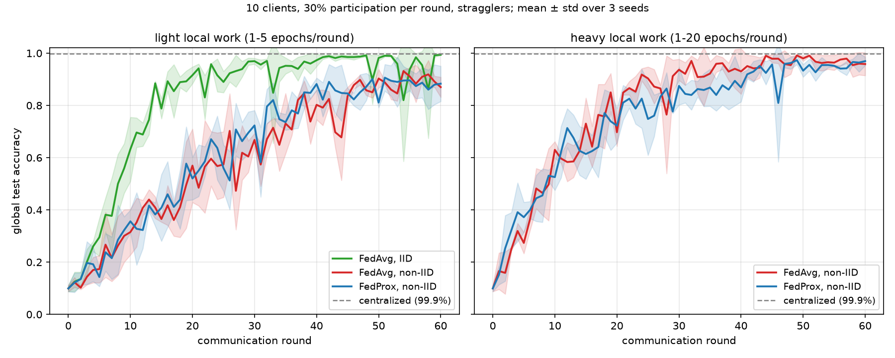

# FedProx does not hold up under the skew it claims to fix

<b>Stack</b> PyTorch, Flower, Ray, CWRU bearing dataset<b>Role</b> Solo

<a class="btn btn--solid" href="https://github.com/AshrithaG/federated-fault-diagnosis" target="_blank" rel="noopener">Code on GitHub</a>

A rounds-to-target convergence plot works well here. Drop it at <code>images/hero.png</code> and replace this block with <code></code>

## Setup

Bearing fault diagnosis is a natural federated learning problem: the data lives on machines at different
sites, it is expensive to centralise, and the failure distributions genuinely differ between sites.

I trained a 1D CNN across **10 federated clients** with Flower and Ray, under two conditions that break
the tidy assumptions: **Dirichlet label skew**, so clients see different fault distributions, and
**stragglers**, so not every client reports on time.

<b>47 to 21</b>rounds to reach 90% accuracy

<b>96.5% +/- 3.5</b>final accuracy

<b>10</b>federated clients under Dirichlet skew

## Convergence

Rounds to reach 90% accuracy fell from **47 to 21**, with final accuracy at **96.5% +/- 3.5**. In a
federated setting rounds are the expensive unit, since each one is a full communication cycle across
every client, so halving them is the result that matters operationally.

## The claim that did not reproduce

FedProx adds a proximal term to the client objective, and its central selling point is robustness under
exactly the conditions I was running: heterogeneous client data and partial participation.

Under Dirichlet skew and stragglers, **that robustness did not materialise** in my runs. It did not
help meaningfully over the baseline on this task.

I want to be precise about what that does and does not mean. This is one dataset, one model
architecture, and one skew regime. It is not a refutation of FedProx. It is a data point that the
robustness claim is conditional in ways the framing does not make obvious, and that anyone reaching for
it as a default should verify it on their own distribution first.

## Why it is here

Half of applied machine learning is choosing between methods on the strength of their abstracts. Running
the comparison yourself, under the conditions you actually have, keeps producing different answers than
the abstracts do.
