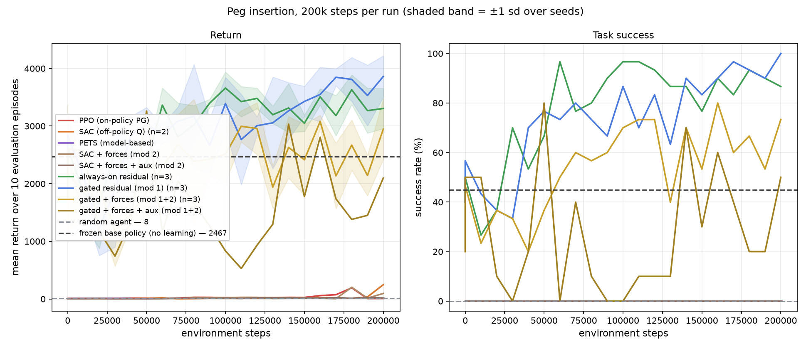
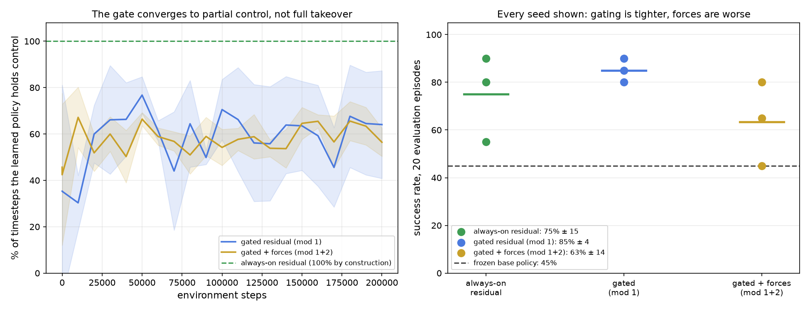

# A policy scoring 85% in metrics and 0% on camera

<b>Stack</b> MuJoCo, MetaWorld, PPO, SAC, PETS/MPPI<b>Role</b> Solo

<a class="btn btn--solid" href="https://github.com/AshrithaG/gated-residual-rl" target="_blank" rel="noopener">Code on GitHub</a>

<figure><figcaption>Return and success rate for every method, across three seeds.</figcaption></figure>

## The method

Residual reinforcement learning over a frozen classical controller. The controller handles the nominal
case, a learned policy proposes corrections, and a **learned gate** decides at each timestep whether to
intervene at all.

<b>85% +/- 4</b>success with the learned gate

<b>45% +/- 20</b>frozen controller alone

<b>66%</b>of timesteps intervened on

<b>3</b>seeds, reported with variance

Across three seeds the gated policy reaches **85% +/- 4** against **45% +/- 20** for the frozen
controller. The variance reduction matters as much as the mean: the gate is not just better on average,
it is more reliable, which is what you want from something built on top of a classical controller you
already trust.

<figure><figcaption>Gate behaviour and per-seed success.</figcaption></figure>

## The result I actually care about

At one point the policy was reporting **85% success in the metrics and doing nothing useful on camera**.

The rendered rollouts showed the arm failing the task. The evaluation said it was succeeding. One of
them was lying.

Tracing it down: **seed and protocol leakage** between the training and evaluation configurations. The
evaluation was not sampling the held-out conditions it was supposed to sample, so the policy was being
scored on situations it had been trained on.

I found it because I watched the videos. There is no metric in the standard MetaWorld reporting stack
that would have caught this, and if I had trusted the number I would have written up a state-of-the-art
result that was an evaluation bug.

## What I take from it

The number and the behaviour are two independent observations, and when they disagree the number is
usually the one that is wrong. Rendering rollouts is cheap. Publishing a leaked evaluation is not.

Everything reported above is post-fix, on a corrected protocol.
