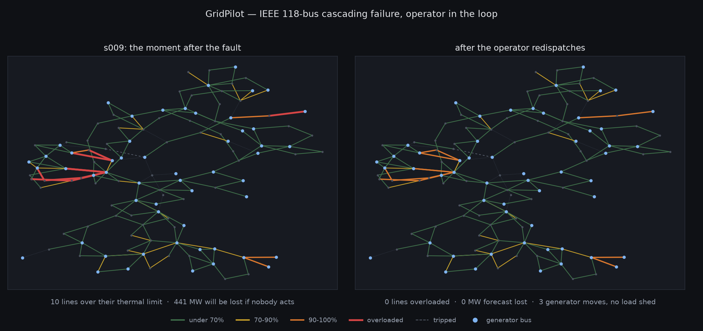

# GridPilot: a guardrail that lets an LLM touch a power grid

<b>Stack</b> Python, pandapower, IEEE 118-bus, LLM tool use, FastAPI<b>Role</b> Solo

<a class="btn btn--solid" href="https://github.com/AshrithaG/gridpilot" target="_blank" rel="noopener">Code on GitHub</a>

A single-line diagram or an incident replay clip suits this one. Drop it at <code>images/hero.png</code> and replace this block with <code></code>

## The premise

Power grid operation under contingency is a good stress test for tool-using agents. The action space is
constrained, the consequences are physical, and there is a simulator that will tell you the truth.

I built an LLM operator for the **IEEE 118-bus network** with a 50-incident benchmark, and then asked
the question that matters for deployment: not whether the model is smart, but whether the **harness**
can stop it doing something catastrophic.

<b>32%</b>less load lost than taking no action

<b>3</b>invalid tool calls across 264 turns

<b>50</b>incident scenarios

## The guardrail

The central design decision is that safety is **enforced in code, not in the prompt**.

Every proposed control action is run through the power-flow simulator first. The result is returned to
the model. Only an action that has been simulated, and whose simulated outcome does not violate the
operating constraints, can be committed. There is no path from the model's output to the grid state
that skips the simulator, so a jailbreak or a hallucinated switch operation cannot reach it.

Prompt-level instructions telling a model to be careful are advisory. A type system that makes the
unsafe action unrepresentable is not.

## Results

Against a 50-incident benchmark, the agent avoided **32% more load loss than inaction**, which is the
honest baseline for a grid operator (doing nothing is often survivable, and any intervention has to beat
it rather than beat random).

Across **264 turns** it made **3 invalid tool calls**. All three were caught by the schema layer before
reaching the simulator, which is the outcome the architecture is designed to produce: model errors
become rejected calls rather than incidents.

## What this is really about

Agent safety papers usually measure whether a model refuses. This measures whether a **system** holds
when the model is wrong, which is the property you actually ship. The interesting artifact is the
contract between the model and the simulator, not the model.
