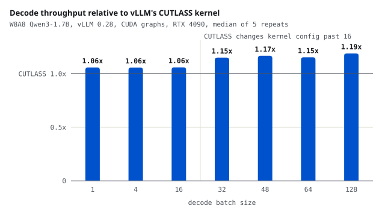

# A Triton int8 kernel, measured in the model it serves

<b>Stack</b> Triton, vLLM 0.28, CUDA graphs, RTX 4090<b>Role</b> Solo

<a class="btn btn--solid" href="https://github.com/AshrithaG/int8-linear" target="_blank" rel="noopener">Code on GitHub</a><a class="btn" href="https://github.com/vllm-project/vllm/issues/56924" target="_blank" rel="noopener">vLLM issue #56924</a>

<figure><figcaption>Decode tokens per second relative to vLLM's CUTLASS kernel, serving a W8A8 Qwen3-1.7B with CUDA graphs. The lead jumps past batch 16, where CUTLASS switches kernel configuration.</figcaption></figure>

## What this is

nanoinfer ended with a Triton int8 GEMM that matched cuBLAS on square matrices. An LLM's linear layers
are not square: at decode they multiply a handful of tokens against weights thousands wide. So I wrote a
W8A8 int8 linear-layer kernel in Triton, with dequantization fused into the same kernel, and measured it
against the kernel vLLM actually uses on NVIDIA, CUTLASS: first one layer at a time, then serving a real
quantized model.

A per-layer win is easy to report and easy to lose inside a model. Most of this project is about the gap
between the two.

<b>1.15x to 1.19x</b>CUTLASS's decode throughput, at batch 32 to 128

<b>1.29x</b>CUTLASS's prefill throughput

<b>M=17</b>where vLLM's CUTLASS kernel slows down, reported upstream

<b>0.85x to 0.90x</b>of CUTLASS without CUDA graphs, where it still loses

## Per layer, then in the served model

Per layer, on Qwen3-1.7B's shapes, the tuned kernel was faster than CUTLASS at all 28 points measured
(median 1.26x), with every output checked against a float64 reference first and the harness agreeing with
vLLM's own kernel benchmark to a median ratio of 1.00.

Serving a W8A8 Qwen3-1.7B in vLLM with CUDA graphs, only the matmul kernel changed between runs:

| batch | over CUTLASS | over #45126's tuned Triton tables | over bf16 |
|---|---|---|---|
| 1 | 1.06x | 1.03x | 1.43x |
| 16 | 1.06x | 1.02x | 1.51x |
| 32 | 1.15x | 1.02x | 1.46x |
| 128 | 1.19x | 1.07x | 1.34x |
| prefill, 8 x 512 | 1.29x | 1.28x | 2.16x |

WikiText-2 perplexity is 20.44 in bf16, 20.49 with CUTLASS and 20.52 with the Triton kernels, and neither
int8 result is distinguishable from bf16 on that sample. Three different Triton kernels, vLLM's, #45126's
and mine, produced bit-identical logprobs on all 20,440 tokens, because each accumulates the int8 product
exactly and applies the scales in the same order.

## Finding one: vLLM's CUTLASS kernel slows down at batch 17

Per layer, CUTLASS's time roughly doubled between batch 16 and 64. vLLM's source picks one compiled CUTLASS
configuration per power-of-two bucket of the batch size, so before sweeping I wrote down what that predicts:
a jump at a bucket edge, flat inside buckets, and no jump for the one layer whose width gets a different
configuration.

It held. CUTLASS steps up 1.31x to 1.99x from M=16 to M=17 on five layer shapes, 1.06x on the sixth, and
moves by at most 10% inside a bucket while the batch nearly doubles. vLLM pads decode batches up to a
captured size, so every batch of 17 to 64 lands there, and this kernel's lead jumps from 1.06x at batch 16
to 1.15x at batch 32. I reported it as [vllm-project/vllm#56924](https://github.com/vllm-project/vllm/issues/56924), with a standalone repro.

## Finding two: timing layers alone mispredicts the served model

My first two tables were tuned from isolated per-layer timings. The second made decode 6.5% slower at batch
128, although its configurations summed faster in isolation, and at batch 64 a 10-microsecond lead over
#45126 per decoder layer vanished in the model.

So I built a stand-in: 28 decoder layers of the same int8 layers, each with its own weights, with the
activation quantizer, norms and activation function between them, captured as one CUDA graph. Before I
trusted it, it had to reproduce the served runs on criteria fixed in advance. Change per decoder layer when
the second table replaced the first, in microseconds:

| batch | stand-in | served model |
|---|---|---|
| 32 | +1.6 | +1.2 |
| 48 | -4.9 | -5.2 |
| 128 | +13.9 | +14.1 |

It also put this kernel 0.2 microseconds per decoder layer ahead of #45126 at batch 64, exactly as served.
Tuned inside the stand-in, the third served run decoded at least as fast as either earlier table at every
batch size, and 8.1% faster than the second at batch 128, a change the stand-in predicted to within half a
microsecond per decoder layer.

## Where it loses

- **Without CUDA graphs** it decodes at 0.85x to 0.90x of CUTLASS. Inside the served model its matmul call
  costs 45.6 microseconds of host time against CUTLASS's 29.5, three times the gap measured alone, and I have
  not found why.
- **Against #45126 end to end** the lead is small: 1.01x to 1.03x up to batch 64, though per layer it is a
  median 1.28x.
- **The stand-in is not the model.** It leaves out attention, and it predicted the gap to CUTLASS less well
  than it predicted changes to my own kernel.
- **Scope.** One GPU and one small model served end to end.

## Why this write-up exists

The per-layer benchmark put the median gain over CUTLASS at 1.26x to 1.44x. The served model gets 6% to 19%.
Both numbers are real, but only one is what serving gets, and telling them apart took three served runs and a
stand-in that had to earn its place before it was allowed to choose anything.
