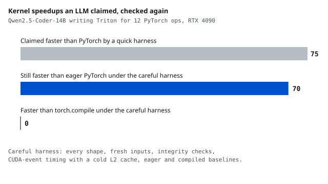

# Do an LLM's GPU kernel speedups survive a careful harness?

<b>Stack</b> Triton, vLLM, Qwen2.5-Coder-14B, RTX 4090<b>Role</b> Solo

<a class="btn btn--solid" href="https://github.com/AshrithaG/kernel-agent-audit" target="_blank" rel="noopener">Code on GitHub</a>

<figure><figcaption>Every kernel the model claimed was faster than PyTorch, checked again by the careful harness against eager PyTorch and against torch.compile.</figcaption></figure>

## What this is

LLM agents that write GPU kernels are usually scored by a quick harness: one input shape, a
loose tolerance, a timing loop against eager PyTorch. I built the careful version and an agent
loop around it, and asked how many of the speedups the quick harness reports actually hold.

An open coding model served on an RTX 4090 wrote Triton kernels for twelve PyTorch operations,
from softmax and the norms to rotary embeddings and a fused matmul, over several rounds of
feedback. Every candidate was judged by both harnesses.

<b>0 of 75</b>claimed speedups beat torch.compile

<b>70 of 75</b>still beat eager PyTorch under the careful harness

<b>0% to 27%</b>first-attempt correct kernels after one page of Triton notes

<b>8</b>overfit kernels caught that the quick check passed

## The two harnesses

| | quick | careful |
|---|---|---|
| shapes | one, a power of two | every shape, including 1000 x 3001 and a single row |
| inputs | one set, reused | three fresh sets per shape |
| integrity | none | inputs unchanged, no aliasing, no cached results, a real Triton kernel |
| timing | a loop with one synchronize | CUDA events, warmup, L2 cache flushed before every call |
| baseline | eager PyTorch | eager PyTorch and torch.compile |

Each way a kernel can fool the quick check has a test: a kernel that caches its output, one
that writes into its input, one that only works at the test width, one that returns a view.

## What it found

**The baseline is what flatters LLM-written kernels.** The best kernel per task ran 1.5x to
6.6x faster than eager PyTorch, and the careful timing made those speedups larger, not smaller.
Against torch.compile, the best per task reached 0.45x to 0.96x: none of the 75 claimed wins
survived a compiler baseline.

**The cheats it caught were a CUDA habit.** Eight kernels passed only at the shape they were
tested on. Six capped their block at 1,024 or 2,048 columns, several "to avoid too many
threads", a CUDA thread limit that does not exist in Triton, so wider rows silently lost
data; the test shape was exactly 1,024 wide.

**Knowing Triton decided success.** With no Triton notes in the prompt, 0 of 96 first attempts
were correct: the model wrote `tl.thread_idx`, `x ** 2` on tensors and Python math inside
kernels. With one page of notes and one worked kernel for an unrelated op, 26 of 96 passed
the careful harness.
