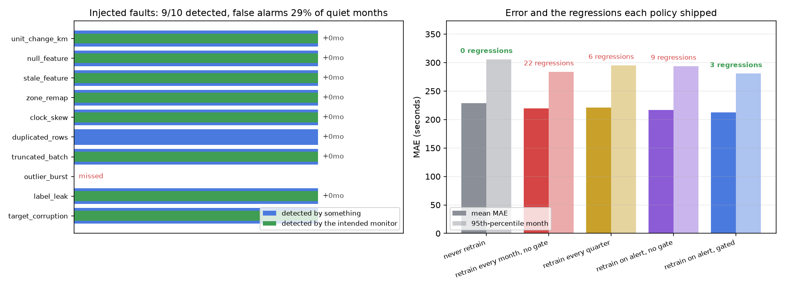
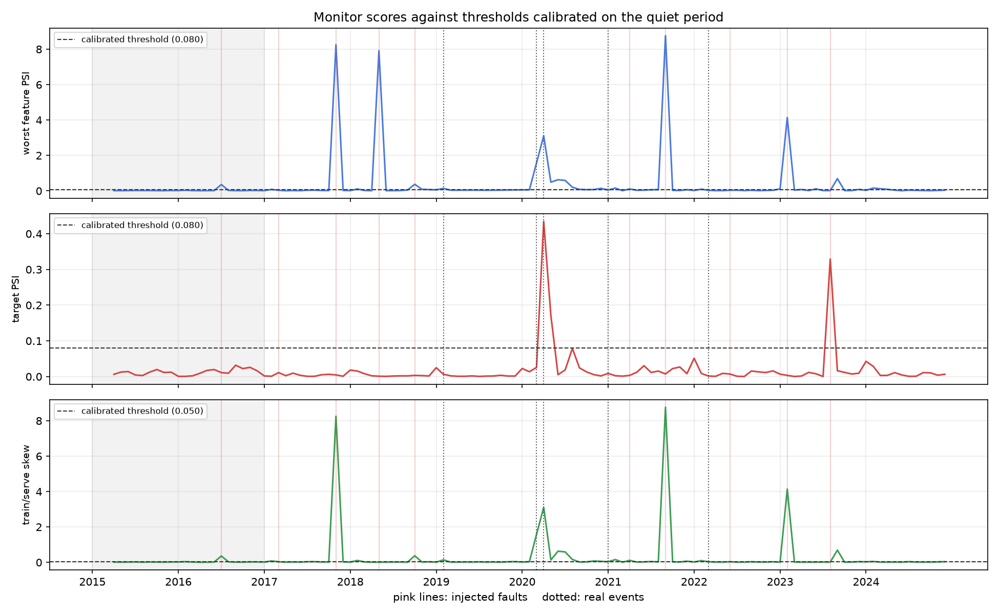

# Auditing the monitors instead of trusting them

<b>Stack</b> Python, paired bootstrap, drift monitoring, Docker<b>Role</b> Solo

<a class="btn btn--solid" href="https://github.com/AshrithaG/mlops-replay" target="_blank" rel="noopener">Code on GitHub</a>

<figure><figcaption>Detection and cost across the replayed history.</figcaption></figure>

## What it is

A full model lifecycle, replayed. **120 months** of production-style data pushed through score, label,
retrain, gate, and promote, so that different retraining and gating policies can be compared on
identical history rather than argued about.

<b>120</b>months replayed end to end

<b>3 vs 22</b>regressions shipped, gated against monthly retraining

<b>9 of 10</b>injected faults detected

<b>75% to 29%</b>false alarm rate after rolling baselines

## Result one: retraining on a schedule ships regressions

The common practice is to retrain monthly and promote the new model. Over 120 replayed months that
policy shipped **22 regressions**.

Replacing the schedule with a **paired-bootstrap significance gate**, which promotes only when the new
model beats the incumbent by more than sampling noise on the same examples, brought that down to
**3**. Same data, same models, same cadence. The only change is requiring evidence before promotion.

<figure><figcaption>Monitor scores against calibrated thresholds.</figcaption></figure>

## Result two: testing the monitors themselves

Drift monitors are the thing that is supposed to catch problems, and they are almost never themselves
tested. So I injected **10 synthetic faults** into the replay and asked whether the monitoring caught
them.

It caught **9 of 10**. Useful to know, and more useful to know which one it missed.

The bigger problem was the opposite direction. The naive monitor configuration fired on **75%** of
months, which in practice means an on-call engineer stops reading the alerts by month three. Switching
to **rolling baselines**, so the comparison is against recent history rather than a frozen reference,
cut the false alarm rate to **29%** while keeping detection.

## Why this shape of project

Most MLOps writing is about tooling. This is about whether the loop actually works, and the way to find
out is to run the loop against known-bad inputs and see what escapes. A monitor you have never fault
injected is a monitor with an unknown detection rate.
