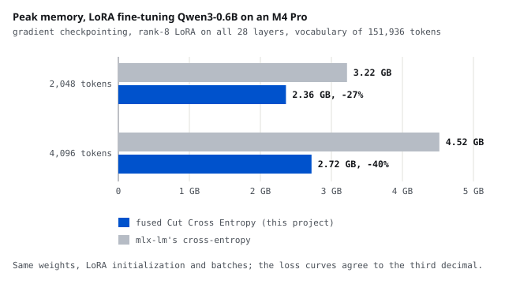

# Cut Cross Entropy on Apple Silicon, in MLX and Metal

<b>Stack</b> MLX, Metal, mlx-lm, M4 Pro<b>Role</b> Solo

<a class="btn btn--solid" href="https://github.com/AshrithaG/mlx-cce" target="_blank" rel="noopener">Code on GitHub</a>

<figure><figcaption>Peak memory per training step, LoRA fine-tuning Qwen3-0.6B on an M4 Pro with gradient checkpointing. The saving grows with tokens per step.</figcaption></figure>

## What this is

Fine-tuning a language model ends in a loss over its whole vocabulary. For Qwen3's 151,936
tokens, the logits for 4,096 tokens are 2.5 GB in fp32 alone, before the softmax and its
gradient. On a MacBook, where the CPU and GPU share one pool of memory, that single tensor
decides how much fits in a training step.

I implemented Cut Cross Entropy (Wijmans et al., 2024) for Apple Silicon: the loss and its
gradient computed without ever materializing the logits, as a custom MLX operation with my
own Metal kernels, and measured it inside real LoRA fine-tuning.

<b>40%</b>less peak memory at 4,096 tokens per step, with gradient checkpointing

<b>27%</b>less at 2,048 tokens per step

<b>0 bytes</b>of logits in device memory during the forward pass

<b>62%</b>of gradient blocks skipped on real hidden states, for a 0.7% gradient error

## How it works

- **A fused Metal forward kernel.** Each threadgroup computes 64 x 64 tiles of logits with
  simdgroup matrix multiplies, keeps them in threadgroup memory and folds them into a running
  max and sum. Only that running max and sum per token ever reach device memory.
- **A chunked backward with a second Metal kernel.** One pass turns each chunk of logits into
  scaled probabilities and the maximum of every 64 x 64 block, replacing six full-size MLX
  operations.
- **Gradient filtering.** Blocks whose probabilities all fall below a threshold are skipped by
  MLX's block-masked matmul, the paper's idea done without atomics.
- **Checked, not assumed.** 53 tests compare every path against an fp32 ground truth on shapes
  that are not multiples of any tile, in fp32, fp16 and bf16, and the fine-tuning loss curves
  match mlx-lm's own to the third decimal.

## Results

| tokens per step | mlx-lm's loss | fused Cut Cross Entropy | saved |
|---|---|---|---|
| 2,048 | 3.22 GB | 2.36 GB | 27% |
| 4,096 | 4.52 GB | 2.72 GB | 40% |

Rank-8 LoRA on all 28 layers of Qwen3-0.6B, gradient checkpointing, 12 training steps, the
same weights, LoRA initialization and batches for every run, each measured in a fresh process.

On the loss alone, peak memory stays flat as tokens grow: about 2 GB at 1,024, 4,096 and
8,192 tokens, while the usual full-logits version already peaks at 2.03 GB at 1,024 tokens
and grows with every token added.

On real Qwen3 hidden states over WikiText-2, filtering at the paper's threshold skips 62% of
the backward's gradient blocks for a 0.7% relative error in the gradient, and the step takes
16% less time.

## A trap in MLX's autodiff

An early version peaked at 20.7 GB in fine-tuning, where mlx-lm's own loss used 9.1 GB, even
though the loss alone was bounded. I traced it to one call: evaluating arrays inside a custom
backward forces the model's forward pass to run while MLX is still building the gradient, and
at that moment MLX keeps every evaluated array alive. The fix keeps the chunk loop as one lazy
graph and orders the chunks with explicit dependencies, so each one is freed before the next
starts. The write-up in the repository walks through the measurements that found it.
