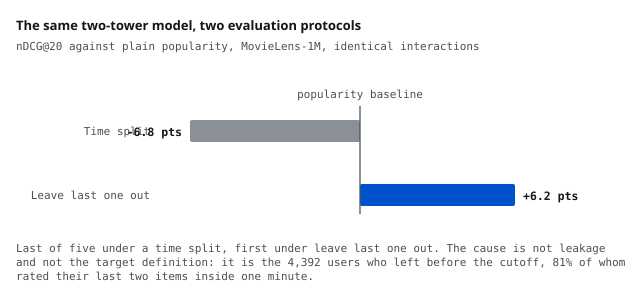

# The split decides which recommender wins

<b>Stack</b> Python, EASE, two-tower, LambdaMART, LightGBM, paired bootstrap<b>Role</b> Solo

<a class="btn btn--solid" href="https://github.com/AshrithaG/movielens-evaluation-protocols" target="_blank" rel="noopener">Code on GitHub</a>

<figure><figcaption>Identical interactions, identical model. Under a time split it is last of five; under leave last one out it is first.</figcaption></figure>

## What this is

Most recommender papers evaluate by holding out each user's last interaction, leave last one out. Almost no production system works that way, because in production you train on the past and serve the future.

I ran the same five models over the same MovieLens-1M interactions under both protocols. The neural two-tower model is last of five under a time split, 6.8 nDCG points below plain popularity, and first under leave last one out, 6.2 points above it. Under the time split only a tuned linear model, EASE, beats popularity at all, and only by 2.6 points.

<b>-6.8 / +6.2</b>two-tower against popularity, time split against leave last one out

<b>4,392 users</b>where the reversal lives, all gone before the cutoff

<b>0.0 days</b>their median activity span

<b>5.2 pts</b>by which a merged 5-generator ranker still trails EASE alone

## The cause is the population, not the leakage

The obvious explanation is that leave last one out leaks the future. That is true and it is not the mechanism here.

A 2x2 over target definition and training window, plus a matched-user control that restricts the comparison to users a time split can actually see, shows EASE winning every cell where the users are held constant. The protocol does not merely leak; it silently changes who is being evaluated.

The reversal lives in the 4,392 users who left before the cutoff. Their median activity span is 0.0 days: 81 percent rated their last two items inside the same minute, which is one sitting on a rating page rather than a sequence of decisions over time. The two-tower model's advantage appears only in that group, and it appears there at every history length, so history length does not explain it either.

This pseudo-sequence artifact in MovieLens is known, and I credit it: Woolridge, Wilner and Glick's "Sequence or Pseudo-Sequence?" (2021) and Fan et al. in TOIS. What this project adds is the decomposition, separating target definition, training window and population, so the effect can be attributed rather than described.

## What a learned ranker does and does not buy

Merging five candidate generators under a LambdaMART ranker does not beat EASE alone. The best merged ranker sits 5.2 points below it over the full test period.

More interesting is that the ranker needs monotone constraints simply to match its own input. Given nothing but EASE's ranking as a feature, an unconstrained ranker loses 1.8 points to EASE, because trees fitted to noisy labels learn a non-monotone mapping and reshuffle an order that was already good. Constraining rank features to be non-increasing and score features non-decreasing recovers EASE to within 0.1 points and lifts the real rankers by 1.4 to 1.6.

Two explanations I tested and rejected: feature layout, which moved nothing, and training only on multi-session users, which was inconsistent.

## Horizon matters too

Calibration is horizon specific. A model tuned on a 27 day validation window predicts 11.4 percent where 4.2 percent is observed over the 790 day test period, so the write-up reports a matched 30 day test horizon alongside the full one. Over a short window popularity beats every model; over the full period, EASE does.
