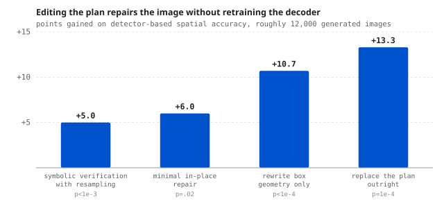

# The plan, not the decoder

<b>Venue</b> ECCV 2026 MUCG Workshop, Oral<b>Author</b> Sole author<b>Subject</b> Reasoning-augmented text-to-image generation

<a class="btn btn--solid" href="https://arxiv.org/abs/2608.21713" target="_blank" rel="noopener">Paper (arXiv 2608.21713)</a>

<figure><figcaption>Points gained on detector-based spatial accuracy by editing the plan rather than retraining the decoder.</figcaption></figure>

## The failure

Text-to-image models fail compositionally. Ask for a red cube on top of a blue sphere and you get a blue
cube, or the right objects in the wrong arrangement, or one of them missing.

Recent systems bolt a reasoning step in front of the generator, having an LLM plan the scene before the
diffusion model renders it. When those systems still fail, the field's default assumption is that the
decoder is not faithful to the plan.

<b>+10.7</b>points from a training-free repair

<b>~12,000</b>images generated for the analysis

<b>Oral</b>ECCV 2026 MUCG Workshop

## Where it actually breaks

I separated the two stages and evaluated them independently across roughly **12,000 generated images**,
which required attributing each failure to either the plan or the rendering rather than scoring the
pipeline end to end.

The failures localise to the **planner**. The plans themselves are wrong, underspecified, or internally
inconsistent before a single denoising step runs. The decoder is largely faithful to what it is given.
It is being given bad instructions.

That inverts where the effort should go. Fine-tuning the decoder for compositional faithfulness is
optimising a component that was already doing its job.

## The repair

Because the problem is in the plan, the fix does not require training anything. Correcting the planning
stage yields **+10.7 points** over the baseline, training-free.

## The methodological point

This is the same shape as most of the work on this site. The end-to-end metric told everyone the system
was failing. It could not tell anyone **which half** was failing, and the field had guessed wrong. The
contribution is the attribution, and the repair follows from it almost immediately once you know where
to look.
