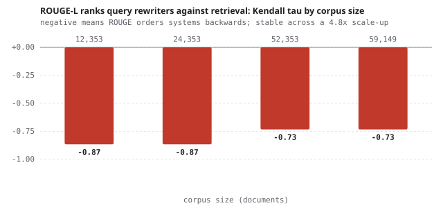

# ROUGE ranks query rewriters backwards

<b>Stack</b> Qwen3-1.7B, LoRA (PEFT), BM25, FastAPI, QReCC<b>Metrics</b> nDCG@10, recall@10, Kendall tau<b>Role</b> Solo

<a class="btn btn--solid" href="https://github.com/AshrithaG/query-rewrite-eval" target="_blank" rel="noopener">Code on GitHub</a>

<figure><figcaption>Kendall tau between ROUGE-L and recall@10 as the corpus scales. Negative throughout, so ROUGE orders the systems backwards.</figcaption></figure>

## Two results, one codebase

This project started as a fine-tuning exercise and turned into an evaluation paper when the metric
disagreed with the retriever.

<b>0.400 to 0.481</b>nDCG@10 from the LoRA fine-tune, against a 0.505 human reference

<b>-0.73 to -0.87</b>Kendall tau, ROUGE-L against recall@10

<b>48,415</b>QReCC training pairs

<b>12,561</b>evaluation turns

## Result one: the fine-tune

Conversational search needs a rewriter that turns a context-dependent follow-up into a standalone
query. I fine-tuned Qwen3-1.7B with LoRA on 48,415 QReCC pairs, using prompt-masked loss so the model is
only scored on the rewrite, and a cosine schedule.

nDCG@10 moved from **0.400 to 0.481** against a human-rewrite ceiling of 0.505. I kept seven checkpoints
and treated each as its own evaluation system, which is what made the second result possible.

## Result two: the metric is anti-correlated with the thing it proxies

Query rewriting is routinely scored with ROUGE against a human reference rewrite, because reference
rewrites are cheap and running a retriever is not.

Across **seven rewriting systems** on **12,561 turns**, ROUGE-L ranks them at Kendall tau
**-0.73 to -0.87** against recall@10. That is not weak correlation. It is ordering them close to
backwards.

The cleanest illustration: the **no-rewrite baseline**, which simply passes the raw follow-up query
through, scored **third-best on ROUGE** while delivering 0.240 recall, near the bottom. It looks
lexically similar to the reference because it shares the user's own words, and it retrieves badly
because it is missing the context that made it a follow-up.

The finding held across a **5x corpus scale-up**, so it is not an artifact of a small index.

## Building the retrieval side

To measure any of this I needed a retriever I could trust and instrument, so I wrote the index myself
rather than calling a service.

- **BM25 from scratch**, with the index, the scorer, and the sharding under my control.
- **Per-shard IDF**, which is where a subtle bug lives: computing IDF within each shard rather than
  globally changes rankings in a way that is invisible until you compare against a single-shard run.
- **A crossover at roughly 400k documents**, below which sharding costs more in coordination than it
  returns in parallelism.
- **A FastAPI fan-out coordinator** with deadline-based partial results and shard-failure injection, so
  the tail-latency and degraded-mode behaviour is tested rather than assumed.

## Takeaway

If you are optimising a rewriter against ROUGE, you may be walking away from retrieval quality with
every step. Score against the retriever, or at minimum validate that your cheap proxy is correlated on
your own data before you trust it.
