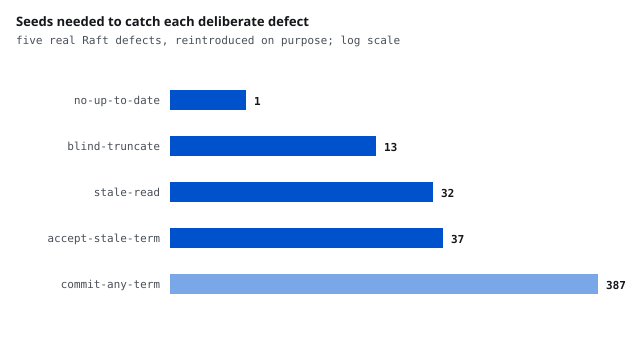

# Raft is the easy part: the harness is the project

<b>Stack</b> Go, deterministic simulation, Wing and Gong linearizability, Bazel<b>Role</b> Solo<b>Result</b> five deliberate defects, all caught

<a class="btn btn--solid" href="https://github.com/AshrithaG/raft-control-plane" target="_blank" rel="noopener">Code on GitHub</a>

<figure><figcaption>Each defect is a real Raft mistake put back on purpose. Figure 8 from the paper took one seed in four hundred.</figcaption></figure>

## Why a consensus implementation proves nothing on its own

Anyone can write a Raft that passes its own tests. The interesting question is
what happens under partitions, crashes, message loss, duplication and
reordering, and whether you can tell. So the implementation here is deliberately
passive: it owns no timers, no goroutines and no sockets. Time arrives through
`Tick`, messages through `Step`, and both return what to send. Everything
nondeterministic lives in the simulator, which draws every delay, drop,
partition and crash from one seed.

That buys the property the project exists for: a run that fails prints its seed,
and rerunning that seed reproduces the failure exactly.

<b>5 of 5</b>deliberate Raft defects caught

<b>1 in 400</b>seeds needed to catch figure 8

<b>2</b>real bugs the harness found in my own code

<b>5.4s vs 31.1s</b>a fresh build machine with the shared cache

## Two questions after every run

The first is whether Raft's own invariants held: one leader per term, logs that
agree wherever they claim to, applied entries identical across nodes. The second
is different and harder: could a single sequential store have produced what the
clients actually saw? A stale read from a deposed leader breaks no Raft
invariant. The logs agree, one leader per term, nothing to see. It only shows up
against a linearizability checker.

That is why reads here go through a barrier. A leader records its commit index,
confirms with a quorum that it still leads, and serves only once its state
machine has caught up.

## Proving the checker works

A checker that never fails is not evidence until it has failed on
implementations known to be wrong. Five real Raft defects are wired behind a
flag, each switched on inside the implementation itself:

| defect | what it removes | caught by |
|---|---|---|
| no-up-to-date | the up-to-date check on votes, so a behind candidate can win | state machine safety, seed 1 |
| blind-truncate | conflict-only truncation, so a stale append erases entries | state machine safety, seed 13 |
| accept-stale-term | the term check, so a deposed leader keeps writing | linearizability, seed 37 |
| stale-read | the read barrier, so a leader answers from local state | linearizability, seed 32 |
| commit-any-term | the current-term commit rule, which is figure 8 in the paper | state machine safety, seed 387 |

Two of the five are caught only by the linearizability checker and not by any
invariant, which is the argument for having both. Figure 8 is the honest
outlier: random fault injection found it once in four hundred seeded runs and
not at all under two of the three fault profiles. It is a true positive, not a
flake, because the same seed is clean on the correct implementation. A scripted
scenario would catch it reliably, and a seed count is a poor substitute.

## The two bugs it found in my own code

**A stale read the barrier was supposed to prevent.** A read at tick 1158
returned a value that two writes, both already acknowledged by tick 1007, had
overwritten. The cause was not in the log handling: read barriers were
identified by a counter that restarts at 1 after a crash, so a client still
waiting on barrier 1 from before the crash was matched to a barrier confirmed in
an earlier term. Identifiers now carry the term.

**A checker that convicted a correct implementation.** Before that, the same seed
failed for a different reason. My checker forced every timed-out operation into
the history, when an operation whose result the client never learned may simply
never have taken effect. Both readings are legal and the search now branches on
both. That is why the checker has its own tests against six histories whose
answers are known by hand: a checker nobody has checked is not a checker.

## Built with Bazel, because the claim is measurable

| case | wall time |
|---|---|
| cold: empty output base, empty cache | 31.1s |
| no-op | 0.4s |
| fresh machine, warm shared cache | 5.4s |
| edit that reaches the test binary | 0.9s, and only that test re-runs |

Two subtler results sit in that table. A comment-only edit recompiles the
package and re-runs nothing, because the compiler emits an identical archive.
Adding an unused function also re-runs nothing, because the linker drops it and
the test binary is byte for byte the same. Only a change that reaches the binary
re-runs its test. The Go toolchain is pinned and downloaded by Bazel, and CI
runs on a machine with no Go installed to prove the build does not depend on
one.

## Limits

No log compaction, no snapshots, no membership change. Client histories are
checked in a 64-operation window, because the search memoizes on a 64-bit set.
Nobody lies: crashes, losses, delays, duplicates and reordering are in scope,
Byzantine faults are not. And the virtual clock says nothing about throughput on
a real network.
