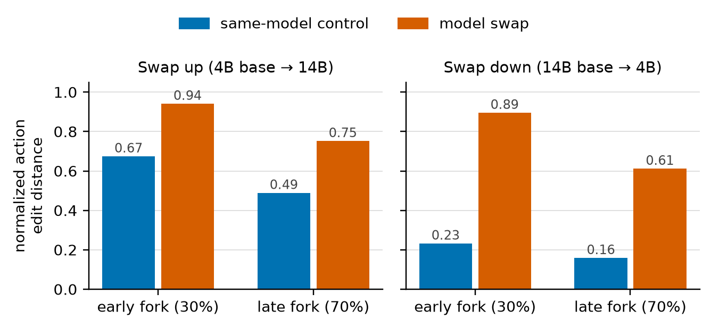
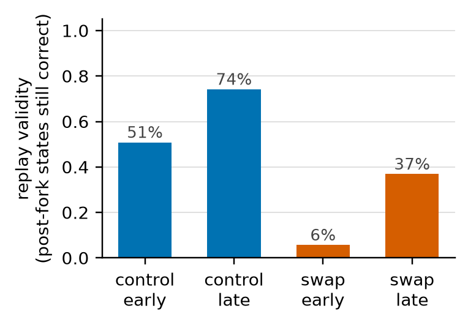

# The Replay Gap: static evaluation of model switching scores the wrong world

<b>Venue</b> COLM 2026 Workshop on Efficient Reasoning<b>Author</b> Sole author<b>Stack</b> vLLM, FP8/AWQ, SWE-bench, mini-SWE-agent

<a class="btn btn--solid" href="https://arxiv.org/abs/2608.08239" target="_blank" rel="noopener">Paper (arXiv 2608.08239)</a>

<figure><figcaption>Swapping the model mid-trajectory rewrites far more of the remaining actions than a same-model control does, in both directions and at both fork depths.</figcaption></figure>

## The question

LLM agent systems increasingly route between models: a cheap model for easy steps, an expensive one for
hard steps. To decide whether a routing policy is any good, the standard method is **static replay**.
You log trajectories once, then score a hypothetical policy against those logs offline.

The assumption underneath is that switching models at step *k* leaves the rest of the trajectory intact.
It does not. The moment you switch, the agent takes different actions, sees different observations, and
the logged future stops existing.

<b>92 to 97%</b>of switching decisions misscored by static replay

<b>889</b>branching rollouts executed

<b>20,141</b>serving requests characterised

<b>42.5</b>GPU-hours

## What I built

A resumable branching-rollout harness. For a given SWE-bench trajectory and a chosen branch point, it:

1. Replays the agent to step *k*.
2. Rebuilds the exact Docker environment for that repository and commit, so the filesystem state at the
   branch point is real rather than reconstructed.
3. Continues the trajectory from step *k* under a **different** model.
4. Runs to termination and scores the true outcome.

Resumability mattered more than it sounds. At 42.5 GPU-hours across roughly 900 rollouts, a harness that
cannot recover from a preemption is a harness you never finish running.

Serving was co-resident vLLM instances, with FP8 and AWQ quantised variants, so that the cost side of the
routing decision was measured on the same hardware as the quality side rather than taken from a price list.

<figure><figcaption>Replay validity, the share of post-fork states still correct. Swapping early leaves 6 percent of the logged trajectory usable.</figcaption></figure>

## The result

Comparing static replay scores against what actually happens when you branch, static replay gets
**92 to 97% of switching decisions wrong**. Not slightly mis-ranked. Wrong about whether the switch
helped at all.

The direction of the error is not random either. Static replay systematically flatters switching
policies, because the logged future was produced by a model that had already succeeded.

## Why this is a serving paper as much as an evaluation paper

Half the work was making the measurement trustworthy at the infrastructure level:

- **Determinism.** Answers move under batch composition even at temperature zero, which puts a floor on
  how finely you can resolve two policies. I quantified that floor rather than assuming it away.
  A separate study of that effect is written up under
  [batch-invariance](projects.html?p=batch-invariance).
- **Cost.** Characterised across 20,141 requests, including the quantisation variants, so cost per
  solved instance is measured rather than modelled.

## Honest limitations

- SWE-bench is one agentic domain. The mechanism should generalise, but the specific 92 to 97% number
  is measured here and nowhere else.
- Branch points were sampled, not exhaustive. Exhaustive branching over every step is combinatorially
  out of reach at this budget.
