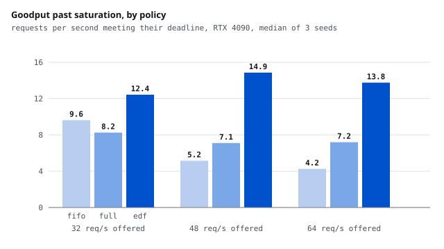

# The router above the engine: what SLO-aware serving actually buys

<b>Stack</b> Go, vLLM 0.28, Qwen3-1.7B, RTX 4090, SPIRE<b>Role</b> Solo<b>Scale</b> 193,249 requests, 0 errors

<a class="btn btn--solid" href="https://github.com/AshrithaG/serving-control-plane" target="_blank" rel="noopener">Code on GitHub</a>

<figure><figcaption>Past saturation the policies separate. Deadline-ordered queueing holds goodput where FIFO collapses.</figcaption></figure>

## The question

vLLM schedules inside one engine. Nothing above it knows that this request has a
three second deadline and that one can wait twenty, that these two customers
have different shares, or that this prompt is already in a particular replica's
cache. Plenty of systems put a router there. I wanted to know what one actually
buys, measured rather than assumed, and where it costs more than it returns.

So I built one in Go and compared four configurations on identical traffic:
straight to a single engine, round robin across two, a central FIFO queue with
bounded dispatch, and the full policy with deadline admission control, per
tenant deficit round robin and prefix-aware placement. Then a fifth, after the
measurements said the fourth was solving the wrong problem.

<b>193,249</b>requests measured on an RTX 4090, zero errors

<b>7.35 vs 4.25</b>goodput at 64 req/s, admission control against FIFO

<b>12x</b>interactive requests met once queues are deadline-ordered

<b>0.7 to 2%</b>goodput admission control costs when nothing is overloaded

## Below capacity, none of it matters

Two vLLM engines sharing one RTX 4090, 70% interactive requests (64 tokens, 3s
deadline) and 30% batch (384 tokens, 20s), open loop arrivals, three seeds per
point. At 4, 8 and 16 requests per second every configuration met the deadline
for essentially everything, and goodput simply tracked offered load. The only
measurable effect of admission control there was a cost: it refused 7 to 20
requests per seed that FIFO went on to serve in time.

Two things surprised me at this end of the range. Splitting one GPU into two
engines doubled time between tokens, 4.9 ms to 10.5 ms, and bought nothing,
because both engines contend for the same SMs. And the second engine sized its
KV cache from what the first left free, so the two replicas were not equal:
59,776 tokens against 49,904. A placement policy that treats replicas as
interchangeable is already wrong on a single card.

## Past capacity, only admission control holds up

| offered | one engine | round robin | FIFO | deadline admission |
|---|---|---|---|---|
| 32 req/s | 6.48 | 5.20 | **9.65** | 8.28 |
| 48 req/s | 4.28 | 3.72 | 5.13 | **7.15** |
| 64 req/s | 3.63 | 3.30 | 4.25 | **7.35** |

Goodput in requests per second that met their deadline. Without a queue in the
router, everything is eventually served and almost nothing on time: 79% late at
32 requests per second, 94% at 64, with median time to first token past a
minute. That is congestion collapse, and it is what a router exists to prevent.

Note the crossover. At 32 requests per second FIFO still wins, because
admission control refuses work the engines could have finished. Only deeper
into overload does refusing early pay.

## The number that needed a second look

At 64 requests per second the full policy delivered 73% more goodput than FIFO.
Broken down by request class, that advantage is entirely batch traffic: 36.8% of
batch requests met their deadline against FIFO's 17.0%, because FIFO spends the
GPU on requests already too old to finish, 1,140 of which missed anyway.
Interactive requests were almost all lost under both, and the full policy served
*fewer* of them than FIFO, 1.6% against 2.6%.

So the headline was true and the story underneath it was the opposite of what I
wanted. The scheduler shared capacity by tenant and had no idea that a three
second request is more urgent than a twenty second one.

## Deadline ordering, and what it trades

The fix is to order each tenant's queue by deadline rather than arrival, and to
charge an arriving request only for queued work due before it. Deadline order
rather than a strict interactive-first rule, because strict priority starves
batch work for as long as interactive work keeps arriving.

At 48 and 64 requests per second this met the deadline for about twelve times as
many interactive requests, 30.4% and 19.9% against 2.5% and 1.7%, while
delivering the same tokens on time as before, within the spread between seeds.
Near the knee it is a real trade: at 32 requests per second it gives up 28% of
FIFO's on-time tokens to lift interactive from 7% to 33%.

The simulator I developed the policies against had predicted a 14% loss of
on-time work from this change. On the GPU there was none. Continuous batching is
the likely reason, and that is a hypothesis rather than something I measured.

## Identity, because a router is a trust boundary

The backends accept work from the router and nobody else. SPIRE issues each pod
an identity from its Kubernetes service account; the backends serve mutual TLS
and authorize by SPIFFE ID; the router only connects to a peer presenting the
backend identity. Verified with two minute certificates: 861 requests and zero
failures across six rotations, an intruder holding a valid identity of its own
refused at the handshake, and the same probe as the router accepted, which is
what shows the refusals came from authorization rather than a broken probe.
Deleting the router's registration took 146 seconds to actually cut its traffic,
longer than the certificate lifetime, because TLS checks a certificate when a
connection opens and not again.

## What it does not show

One GPU, one model, two engines. No multi-GPU, no tensor parallelism. Prefix
cache hits are reported by vLLM as an engine-wide counter rather than per
request, so prefix-aware placement is implemented but not yet judged on
hardware. The policy comparisons are all two-engine, and a single engine with
the same policy is untested. Interactive requests remain mostly unserved past
saturation even with deadline ordering, which points at priority inside the
engine, where a request already running cannot be reordered from outside.

## Three of my own measurements were wrong first

Dividing goodput by the time until the last request drained rewarded a policy
for shedding: under that denominator admission control looked 41% ahead of FIFO,
and under the offered-load window, identical across policies, it was 14% behind.
Deficit round robin credited a queue once per served item instead of once per
visit, so tenant weights did nothing. Admission charged one replica's token debt
plus the whole shared queue against that replica's slots alone, which
overestimated the wait by roughly the replica count. Each of those is fixed, and
each is in the repository's history rather than quietly corrected.
