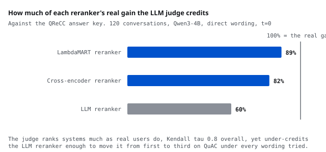

# Can an LLM simulator or an LLM judge pick your search stack?

<b>Stack</b> Python, vLLM, Qwen3-4B-FP8, BM25, BGE, LambdaMART, cross-encoder<b>Role</b> Solo

<a class="btn btn--solid" href="https://github.com/AshrithaG/simulator-control-arms" target="_blank" rel="noopener">Code on GitHub</a>

<figure><figcaption>The judge credits most of what LambdaMART and the cross-encoder really earn, and well under two thirds of what the LLM reranker earns.</figcaption></figure>

## What this is

LLM user simulators and LLM judges are increasingly how search and assistant systems get evaluated, because real users are slow and expensive. The question nobody answers before adopting them is whether they choose the same system a real user would.

So I built the control arm. Five retrieval stacks over QReCC conversations, from BM25 through dense retrieval with reciprocal rank fusion, a LambdaMART reranker, a cross-encoder and an LLM reranker. Then four ways of deciding which stack is best: replaying the real human follow-up questions, which is ground truth here because QReCC records what the person actually asked next; a scripted simulator; an LLM playing the user; and an LLM judge grading frozen retrieval results.

Because the judge grades results frozen from the real-user run, any disagreement it produces is about judging, never about retrieval having changed underneath it.

<b>+0.8</b>Kendall tau between the judge's ranking and real users'

<b>60% vs 89%</b>of the LLM reranker's real gain credited, against LambdaMART's

<b>5 to 10.5 pts</b>rerun noise band, against effects of 2 to 15 pts

<b>0.9 vs 2.7 pts</b>simulator noise, explicit persona against terse

## The judge is nearly right, and wrong in a specific way

Overall the judge orders the stacks much as real users do, Kendall tau 0.8, and it adds almost no sampling noise of its own: 0.8 points between reruns at temperature 0.8. On that evidence you would adopt it.

The failure is not in the ranking, it is in the crediting. Measured against the answer key, the judge awards 89 percent of LambdaMART's real gain and 82 percent of the cross-encoder's, but only 60 percent of the LLM reranker's. That gap is enough to move the LLM reranker from second to third overall, and from first to third on QuAC, under all three judge wordings I tried.

The judge is also lenient in absolute terms. On QuAC it counts 58 to 63 percent of turns as answered where the answer key says 35 percent. A plausible mechanism is that a lenient judge already credits the weaker stacks with success, leaving less headroom for a strong reranker to earn. I have not tested that, and the write-up says so.

## Noise, not significance, sets the evaluation budget

The more uncomfortable result is about sample size. Rerun the identical unchanged stack and the score moves by 5 to 10.5 points depending on the source. Real effects in this setting run from 2 to 15 points, so the noise band swallows most of them.

Concretely: a genuine 15.5 point gain on Natural Questions shows up as about 10 points, and a one-run bootstrap calls it significant while it sits inside the rerun band. Significance testing on a single run and the rerun band disagree often enough that the band, not the p-value, is what should govern how many conversations you run.

For the LLM user arm, the persona sets the budget rather than the model. An explicit persona reruns to within 0.9 points; a terse one to 2.7.

## Two mistakes worth recording

A first run had the LLM reranker operating at depth 10 while the metric was success@10, so reranking could not change the metric at all. The result was void. The runner now refuses any configuration where rerank depth is less than or equal to k.

A refactor also left two supposedly different simulator personas secretly identical, which would have shown up as a reassuringly small persona effect. Both are in the repository's notes rather than quietly fixed, because the point of this project is that measurement apparatus fails silently.
